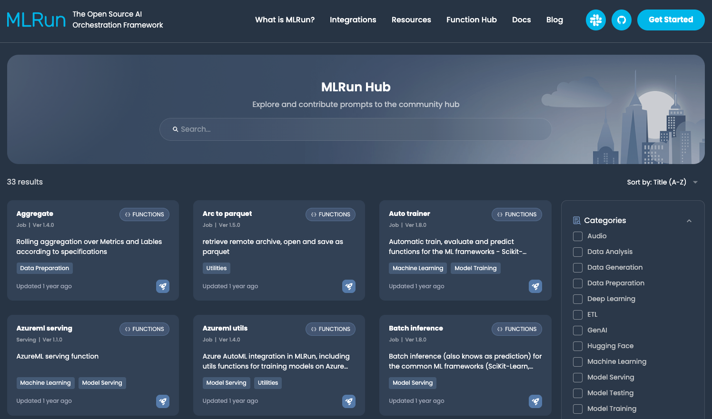

(load-from-hub)=
# MLRun hub <!-- omit in toc -->

The [MLRun hub](https://www.mlrun.org/hub/) has a wide range of functions, modules, and apps that you can incorporate into your projects, for a variety of use cases.
You can search and filter the categories and kinds to find an item that meets your needs.
Reusing built-in code can significicantly speed up your development cycle. 


**In this section**

- [Custom hub](#custom-hub)
- [Loading functions from the MLRun hub](#loading-functions-from-the-mlrun-hub)
- [View the function params](#view-the-function-params)
- [Running the function](#running-the-function)

## Custom hub
Alternatively, you can create your own hub, and connect it to MLRun. Then you can import functions (with their tags) from your custom hub.

### Create a custom hub

You can either fork the [MLRun hub repo](https://github.com/mlrun/functions) and add to it your Git repo, or create a hub from scratch.

```{Note}
Make sure your hub source is accessible via GitHub (private is also possible).
```

To create a hub from scratch, the hub structure must be the same as the [MLRun hub](https://github.com/mlrun/marketplace).

The hierarchy must be:

- functions directory
	- channels directories
		- some-function-1
		- some-function-2
		- ...
		- some-function-n
			- version-1
			- ...
			- version-n
			- latest
				- src
					- function.yaml
					- item.yaml
					- function.py
					- ...
				- static (optional)
					- html files
					


### Add a custom hub to the MLRun database
When you add a hub, specify `order=-1` to add it to the top of the list. 
The list order is relevant when [loading a function](#load-function-example):
if you don't specify a hub name, MLRun starts searching for the function with the last added hub.
If you want to add a hub but not at the top of the list, view the current list using {py:meth}`~mlrun.db.httpdb.HTTPRunDB.list_hub_source`.
The MLRun hub is always the last in the list (and cannot be modified). 


To add a hub, run:
```python
import mlrun.common.schemas

# Add a custom hub to the top of the list
private_source = mlrun.common.schemas.IndexedHubSource(
    order=-1,
    source=mlrun.common.schemas.HubSource(
        metadata=mlrun.common.schemas.HubObjectMetadata(
            name="private", description="a private hub"
        ),
        spec=mlrun.common.schemas.HubSourceSpec(
            path="https://mlrun.github.io/marketplace", channel="development"
        ),
    ),
)

db.create_hub_source(private_source)
```


## Functions

There are functions for ETL, data preparation, training (ML & Deep learning), serving, alerts and notifications and more.
There are modules for application runtime and monitoring applications. 
Each function has a docstring that explains how to use it. The functions and modules are categorized and their associated versions are listed, so you can easily find a suitable function/module for your needs.

### Loading functions from the MLRun hub

This section demonstrates how to import a function from the hub into your project, and provides some basic instructions on how to run the function and view the results.
Learn about [artifact paths](/store/artifacts.md#artifact-path)
Run `project.set_function` to add or update a function object to the project.

`set_function(func, name='', kind='', image=None, with_repo=None)`

Partial list of parameters:

- **func** &mdash; function object or spec/code url.
- **name** &mdash; name of the function (under the project).
- **kind** &mdash; runtime kind e.g. `job`, `nuclio`, `spark`, `dask`, `mpijob`. Default: `job`.
- **image** &mdash; docker image to be used, can also be specified in the function object/yaml.
- **with_repo** &mdash; add (clone) the current repo to the build source.

See all the parameters in {py:meth}`~mlrun.projects.MlrunProject.set_function` API documentation.

### Load function example

The `describe` function analyzes a csv or parquet file for data analysis. 
To load the `describe` function from the MLRun hub:

```python
project.set_function("hub://describe", "describe")
```

To load the same function from your custom hub:
```python
project.set_function("hub://<hub-name>/describe", "describe")
```
```{caution} 
If you don't specify a hub name at all, the algorithm searches for the function in all the hubs, 
giving preference to newly defined hubs. Therefore, if you 
have multiple hubs, best practice is to explicitly mention the hub name.
```

After loading the function, create a function object named, for example, `my_describe`:

```python
my_describe = project.func("describe")
```

## View the function params

To view the parameters, run the function with .doc():

```python
my_describe.doc()
```

``` text
    function: describe
    describe and visualizes dataset stats
    default handler: summarize
    entry points:
      summarize: Summarize a table
        context(MLClientCtx)  - the function context, default=
        table(DataItem)  - MLRun input pointing to pandas dataframe (csv/parquet file path), default=
        label_column(str)  - ground truth column label, default=None
        class_labels(List[str])  - label for each class in tables and plots, default=[]
        plot_hist(bool)  - (True) set this to False for large tables, default=True
        plots_dest(str)  - destination folder of summary plots (relative to artifact_path), default=plots
        update_dataset  - when the table is a registered dataset update the charts in-place, default=False
```

## Running the function

Use the `run` method to run the function.

When working with functions, pay attention to the following:

- Input vs. params &mdash; for sending data items to a function, send it via "inputs" and not as params.
- Working with artifacts &mdash; Artifacts from each run are stored in the `artifact_path`, which can be set globally with the environment variable (MLRUN_ARTIFACT_PATH) or with the config. If it's not already set you can create a directory and use it in the runs. Using `{{run.uid}}` in the path creates a unique directory per run. When using pipelines you can use the `{{workflow.uid}}` template option.

This example runs the describe function. This function analyzes a dataset (in this case it's a csv file) and generates HTML files (e.g. correlation, histogram) and saves them under the artifact path.

```python
DATA_URL = "https://s3.wasabisys.com/iguazio/data/iris/iris_dataset.csv"

my_describe.run(name="describe", inputs={"table": DATA_URL}, output_path=artifact_path)
```

### Saving the artifacts in a unique folder for each run  <!-- omit in toc -->

```python
out = mlconf.artifact_path or path.abspath("./data")
my_describe.run(
    name="describe",
    inputs={"table": DATA_URL},
    output_path=path.join(out, "{{run.uid}}"),
)
```

### Viewing the jobs & the artifacts  <!-- omit in toc -->

There are few options to view the outputs of the jobs you ran:
- In the MLRun UI, under the project name, you can view the job that was running as well as the artifacts it generated.
- In Jupyter the result of the job is displayed in the Jupyter notebook. When you click on the artifacts it displays its content in Jupyter.
## Apps
### Loading apps from the MLRun hub