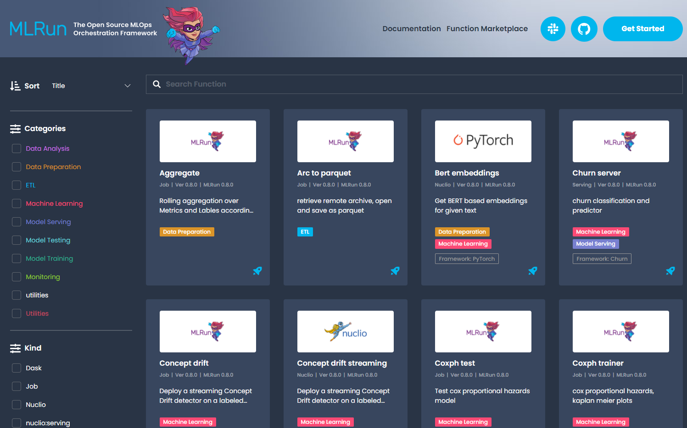

# MLRun Functions Marketplace  <!-- omit in toc -->

- [Overview](#overview)
- [Functions Marketplace](#functions-marketplace)
- [Searching for functions](#searching-for-functions)
- [Setting the project configuration](#setting-the-project-configuration)
- [Loading function from the marketplace](#loading-function-from-the-marketplace)
- [View the function params](#view-the-function-params)
- [Running the function](#running-the-function)

## Overview

In this tutorial we'll demonstrate how to import a function from the marketplace into your own project and provide some basic instructions of how to run the function and view their results.

## Functions Marketplace

MLRun marketplace has a wide range of functions that can be used for a variety of use cases.
In the marketplace there are functions for ETL, data preparation, training (ML & Deep learning), serving, alerts and notifications and etc..
Each function has a docstring that explains how to use it and in addition the functions are associated with categories to make it easier for the user to find the relevant one.

Functions can be easily imported into your project and therefore help users to speed up their development cycle by reusing built-in code.



## Searching for functions

The Marketplace is stored in this GitHub repo: <https://github.com/mlrun/marketplace/tree/master/functions/master> <br>
In the README file you can view the list of functions in the marketplace and their categories.

## Setting the project configuration

The first step for each project is to set the project name and path:

```python
from os import path, getenv
from mlrun import new_project

project_name = 'load-func'
project_path = path.abspath('conf')
project = new_project(project_name, project_path, init_git=True)

print(f'Project path: {project_path}\nProject name: {project_name}')
```

### Set the artifacts path  <!-- omit in toc -->

The artifact path is the default path for saving all the artifacts that the functions generate:

```python
from mlrun import run_local, mlconf, import_function, mount_v3io

# Target location for storing pipeline artifacts
artifact_path = path.abspath('jobs')
# MLRun DB path or API service URL
mlconf.dbpath = mlconf.dbpath or 'http://mlrun-api:8080'

print(f'Artifacts path: {artifact_path}\nMLRun DB path: {mlconf.dbpath}')
```

## Loading function from the marketplace

Loading functions is done by running `project.set_function` <br>
`set_function` updates or adds a function object to the project

`set_function(func, name='', kind='', image=None, with_repo=None)`

Parameters:

- **func** – function object or spec/code url
- **name** – name of the function (under the project)
- **kind** – runtime kind e.g. job, nuclio, spark, dask, mpijob default: job
- **image** – docker image to be used, can also be specified in the function object/yaml
- **with_repo** – add (clone) the current repo to the build source

Returns: project object

For more information see the [`set_function` API documentation](api/mlrun.projects.html#mlrun.projects.MlrunProject.set_function).

### Load function Example  <!-- omit in toc -->

In this example we load the describe function. this function analyze a csv or parquet file for data analysis

```python
project.set_function('hub://describe', 'describe')
```

Create a function object called my_describe:

```python
my_describe = project.func('describe')
```

## View the function params

In order to view the parameters run the function with .doc()

```python
my_describe.doc()
```

``` text
    function: describe
    describe and visualizes dataset stats
    default handler: summarize
    entry points:
      summarize: Summarize a table
        context(MLClientCtx)  - the function context, default=
        table(DataItem)  - MLRun input pointing to pandas dataframe (csv/parquet file path), default=
        label_column(str)  - ground truth column label, default=None
        class_labels(List[str])  - label for each class in tables and plots, default=[]
        plot_hist(bool)  - (True) set this to False for large tables, default=True
        plots_dest(str)  - destination folder of summary plots (relative to artifact_path), default=plots
        update_dataset  - when the table is a registered dataset update the charts in-place, default=False
```

## Running the function

Use the `run` method to to run the function.

When working with functions pay attention to the following:

- Input vs params - for sending data items to a function, users should send it via "inputs" and not as params.
- Working with artifacts - Artifacts from each run are stored in the artifact_path which can be set globally through environment variable (MLRUN_ARTIFACT_PATH) or through the config, if its not already set we can create a directory and use it in our runs. Using {{run.uid}} in the path will allow us to create a unique directory per run, when we use pipelines we can use the {{workflow.uid}} template option.

In this example we run the describe function. this function analyze a dataset (in our case it's a csv file) and generate html files (e.g. correlation, histogram) and save them under the artifact path

```python
DATA_URL = 'https://s3.wasabisys.com/iguazio/data/iris/iris_dataset.csv'

my_describe.run(name='describe',
                inputs={'table': DATA_URL},
                artifact_path=artifact_path)
```

### Saving the artifacts in a unique folder for each run  <!-- omit in toc -->

```python
out = mlconf.artifact_path or path.abspath('./data')
my_describe.run(name='describe',
                inputs={'table': DATA_URL},
                artifact_path=path.join(out, '{{run.uid}}'))
```

### Viewing the jobs & the artifacts  <!-- omit in toc -->

There are few options to view the outputs of the jobs we ran:

- In Jupyter - the result of the job is displayed in Jupyter notebook. Note that when you click on the artifacts it displays its content in Jupyter.
- UI - going to the MLRun UI, under the project name, you can view the job that was running as well as the artifacts it was generating
