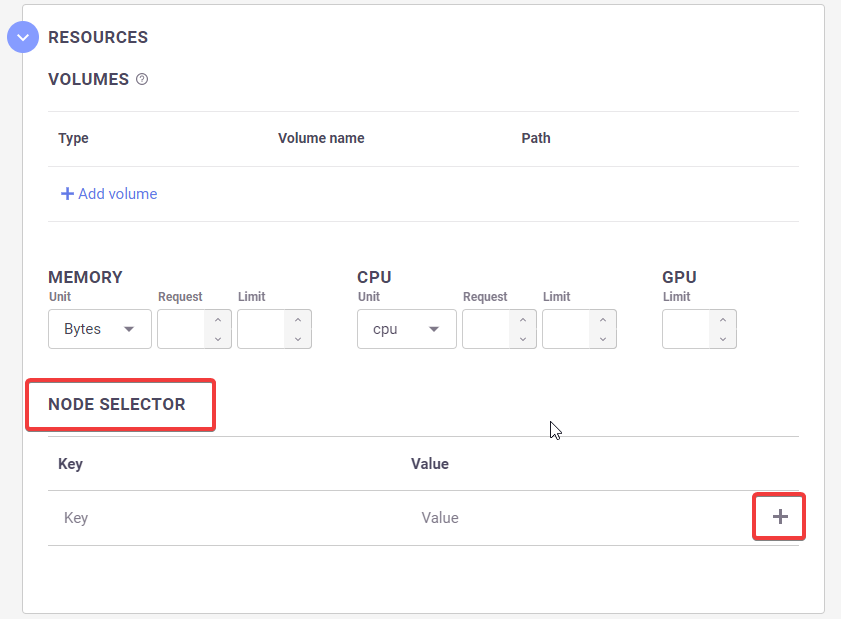
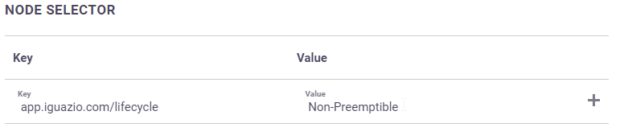
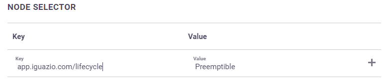

# Node affinity for MLRun jobs
Node affinity can be applied to MLRun to determine on which nodes 
they can be placed. The rules are defined using custom labels on nodes and label selectors. 
Node affinity allows towards Spot or On Demand groups of nodes.

## On Demand vs Spot 

Amazon Elastic Compute Cloud (Amazon EC2) provides scalable computing capacity in the Amazon Web Services (AWS) Cloud. 
Using Amazon EC2 eliminates your need to invest in hardware up front, so you can develop and deploy applications faster. 

Using the Iguazio platform you can deploy two different kinds of EC2 instances, on-demand and spot. 
On-Demand Instances provide full control over the EC2 instance lifecycle. You decide when to launch, stop, hibernate, start, 
reboot, or terminate it. With spot instances you request EC2 capacity from specific availability zones and is 
susceptible to spot capacity availability. This is a good choice if you can be flexible about when your applications run 
and if your applications can be interrupted.

## Stateless and Stateful Applications 
When deploying your MLRun jobs to specific nodes, please take into consideration that on demand 
nodes are best designed to run stateful applications while spot nodes are best designed to stateless applications. 
MLRun jobs which are stateful, and are assigned to run on spot nodes, may be subject to interruption 
and will to be designed so that the job/function state will be saved when scaling to zero.

## Node Selector
Using the **Node Selector** you can assign MLRun jobs to specific nodes within the cluster. 
**Node Selector** is available for all modes of deployment in the platform including the platform UI, 
command line, and programmable interfaces.

To assign MLRun jobs to specific nodes you use the Kubernetes node label 
`app.iguazio.com/lifecycle` with the values of:

* preemptible – assign to EC2 Spot instances

* non-preemptible – assign to EC2 On Demand instances

```{admonition} Note
By default Iguazio uses the key:value pair 
<br>
```app.iguazio.com/lifecycle = preemptible```
<br>
or
<br>
```app.iguazio.com/lifecycle = non-preemptible```
<br>
to determine spot or on demand nodes.
```

You can use multiple labels to assign MLRun jobs to specific nodes. 
However, when you use multiple labels a logical `and` is performed on the labels.

```{admonition} Note
* Do not use node specific labels as this may result in eliminating all possible nodes.
* When assigning MLRun jobs to Spot instances it is the user’s responsibility 
  to deal with preempting issues within the running application/function.
``` 

**To assign an MLRun job to a node:**
1. From the platform dashboard, press projects in the left menu pane.
2. Press on a project, and then press Jobs and Workflows.
3. Press New Job, or select a job from the list of running jobs.
4. Scroll to and open the Resources pane.
5. In the **Node Selector** section, press **+**.
   <br>
   <br/>
   
<br>
<br/>
6. Enter a **key:value** pair. For example:
   <br>
   <br/>
   
   <br>
   <br/>
   or
   <br>
   <br/>
   
   <br>
   <br/>
   When complete press **Run now** or **Schedule for later**.  
<br>

**Assign an MLRun job to a node using the SDK**

You can use node selection using the SDK by adding the key:value pairs in your Jupyter notebook. 
For On demand use the following function:
<br><br>
```func.with_node_selection(node_selector={'app.iguazio.com/lifecycle': 'non-preemptible'})```
<br><br>
For Spot instances use the following function:
<br><br>
```func.with_node_selection(node_selector={'app.iguazio.com/lifecycle': 'preemptible'})``` 
