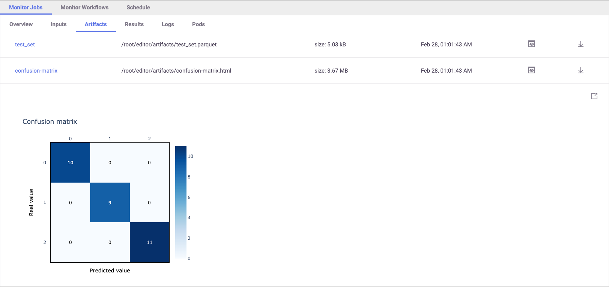
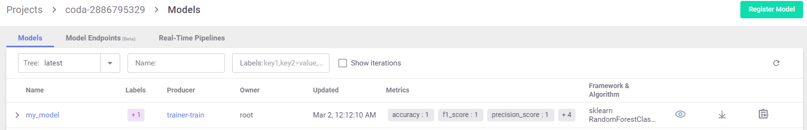

(run-simple-jobs)=
# Running simple jobs

## Run with CLI locally: CSV output

Run the data generation function `gen-iris` (see `gen_iris.py`:

`mlrun run -f gen-iris --local`

> `--local` indicates that it's running locally (not over the cluster)

Notice the use of MLRun `with mlrun.get_or_create_ctx()` in the code.
It wraps your code, automatically tracking the execution.

View the output CSV file in `artifacts/dataset.csv`

## Run with CLI locally: python output

You can also run the function using the regular `Python` command:

`python3 gen_iris.py`

However, when using `python` you have limited control over the execution. See more in [MLRun execution context](../concepts/mlrun-execution-context.html).

## Run with CLI locally: parquet output

Run the function again, and this time pass the `format=parquet` arg:

`mlrun run -f gen-iris -p format=parquet --local`

This time the dataset is created in `parquet` format:

> `-p` is used to specify parameters. See [CLI](../cli.html) for more flags.

Results can be accessed via the CLI, SDK, or UI. 

## Run with SDK

Initialize an MLRun Project and Generate Data. First load the MLRun project:

`project = mlrun.load_project("./", init_git=True)`

Run the data generation function `gen-iris` as in the previous scenario:

`gen_data_run = project.run_function("gen-iris", local=True)`

## Viewing the output

The auto-logging for SciKit-Learn includes many plots and metrics. The metrics and artifacts are chosen according to the 
model algorithm used (classification or regression). You can add more metrics and artifacts and even write your 
own. <!-- To learn more about choosing metrics, artifacts and adding custom ones, we suggest reading more on MLRun's docs. -->

Print the metrics and artifacts generated automatically by the apply_mlrun()` method:

   `pprint(trainer_run.outputs)`

Once the run is complete open the MLRun UI and see the artifacts and results, similar to:



All of the metrics and artifacts are stored as metadata of the model, so it's easy to do a comparison 
between models later on.

### Model Registry

Models and their metadata are automatically stored in the **Model Registry**. Check the Model Artifacts Tab to see the models.



Model objects can be read from the MLRun DB and used in different applications. The following example lists all of the  
model objects and prints one as YAML. Details that are automatically stored with the model include results, artifacts, statistics, schema, etc.

```python
models = mlrun.get_run_db().list_artifacts(kind="model")
print(models.objects()[0].to_yaml())
```

### Train the model

Now, assume you have a training function `trainer.py` to train a model on the training data.
Execute the training function with specific data inputs and parameters. These are recorded and versioned with the run. 
The training function is already set in the project, so all you need to do is use the dataset from the `gen_data_run` outputs:

```python
trainer_run = project.run_function(
    "trainer", 
    inputs={"dataset": gen_data_run.outputs["dataset"]}, 
    params = {"n_estimators": 100, "max_depth": 5},
    local=True
)
```