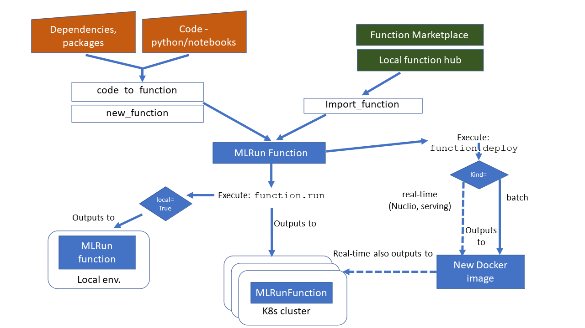

(using-functions)=
# Configuring functions

**MLRun Functions** (function objects) can be created by using any of the following methods:

- **{py:func}`~mlrun.run.new_function`**: creates a function from code repository/archive.
- **{py:func}`~mlrun.run.code_to_function`**: creates a function from local or remote source code (single file) or from 
 a notebook (code file will be embedded in the function object).
- **{py:func}`~mlrun.run.import_function`**: imports a function from a local or remote YAML function-configuration file or 
  from a function object in the MLRun database (using a DB address of the format `db://<project>/<name>[:<tag>]`)
  or from the function marketplace (e.g. `hub://describe`). See [MLRun Functions Hub](./load-from-marketplace.html).

When you create a function, you can:
- Use the {py:meth}`~mlrun.runtimes.BaseRuntime.save` function method to save a function object in the MLRun database.
- Use the {py:meth}`~mlrun.runtimes.BaseRuntime.export` method to save a YAML function-configuration to your preferred 
local or remote location.
- Use the {py:meth}`~mlrun.runtimes.BaseRuntime.run` method to execute a task.
- Use the {py:meth}`~mlrun.runtimes.BaseRuntime.as_step` method to convert a function to a Kubeflow pipeline step.
- Use the `.deploy()` method to build/deploy the function. (Deploy for batch functions builds the image and adds the required packages. 
For online/real-time runtimes like `nuclio` and `serving` it also deploys it as an online service.)

Functions are stored in the project and are versioned so you can always view previous code and go back to previous functions if needed.

The general concepts described in this section are illustrated in the following figure:



**In this section**
* [Providing Function Code](#providing-function-code)
* [Specifying the function’s execution handler or command](#specifying-the-function-execution-handler-or-command)
* [Function Runtimes](#function-runtimes)

## Providing Function Code

When using `code_to_function()` or `new_function()`, you can provide code in several ways:
- [As part of the function object](#provide-code-as-part-of-the-function-object)
- [As part of the function image](#provide-code-as-part-of-the-function-image)
- [From the git/zip/tar archive into the function at runtime](#provide-code-from-a-git-zip-tar-archive-into-the-function-at-runtime)

### Provide code as part of the function object
This method is great for small and single file functions or for using code derived from notebooks. This example uses the mlrun 
{py:func}`~mlrun.code_to_function` method to create functions from code files or notebooks. 

    # create a function from py or notebook (ipynb) file, specify the default function handler
    my_func = mlrun.code_to_function(name='prep_data', filename='./prep_data.py', kind='job', 
    image='mlrun/mlrun', handler='my_func')

For more on how to create functions from notebook code, see [Converting notebook code to a function](./mlrun_code_annotations.html).

### Provide code as part of the function image

Providing code as part of the image is good for ensuring that the function image has the integrated code and dependencies, 
and it avoids the overhead of loading code at runtime. 

Use the {py:meth}`~mlrun.runtimes.KubejobRuntime.deploy()` method to build a function image with source code, 
dependencies, etc. Specify the build configuration using the {py:meth}`~mlrun.runtimes.KubejobRuntime.build_config` method. 

```
    # create a new job function from base image and archive + custom build commands
    fn = mlrun.new_function('archive', kind='job', command='./myfunc.py')
    fn.build_config(base_image='mlrun/mlrun', source='git://github.com/org/repo.git#master',
                    commands=["pip install pandas"])
    # deploy (build the container with the extra build commands/packages)
    fn.deploy()
    
    # run the function (specify the function handler to execute)
    run_results = fn.run(handler='my_func', params={"x": 100})
```

Alternatively, you can use a pre-built image:

```
# provide a pre-built image with your code and dependencies
fn = mlrun.new_function('archive', kind='job', command='./myfunc.py', image='some/pre-built-image:tag')
    
# run the function (specify the function handler to execute)
run_results = fn.run(handler='my_func', params={"x": 100})
```

You can use this option with {py:func}`~mlrun.run.new_function` method.


### Provide code from a git, zip, tar archive into the function at runtime

This option is the most efficient when doing iterative development with multiple code files and packages. You can 
make small code changes and re-run the job without building images, etc. You can use this option with the 
{py:func}`~mlrun.run.new_function` method.

The `local`, `job`, `mpijob` and `remote-spark` runtimes support dynamic load from archive or file shares. (Other 
runtimes will be added later.) Enable this by setting the `spec.build.source=<archive>` and 
`spec.build.load_source_on_run=True` 
or simply by setting the `source` attribute in `new_function`). In the CLI, use the `--source` flag. 

    fn = mlrun.new_function('archive', kind='job', image='mlrun/mlrun', command='./myfunc.py', 
                            source='git://github.com/mlrun/ci-demo.git#master')
    run_results = fn.run(handler='my_func', params={"x": 100})

See more details and examples on [running jobs with code from Archives or shares](./code-archive.html).

## Specifying the function execution handler or command

The function is configured with code and dependencies, however you also need to set the main execution code 
either by handler or command.

**Handler**

A handler is a method (not a script) that executes the function, for either a one-time run or ongoing online services.  

**Command**

The `command='./myfunc.py'` specifies the command that is executed in the function container/workdir. 

By default MLRun tries to execute python code with the specified command. For executing non-python code, set 
`mode="pass"` (passthrough) and specify the full execution `command`, e.g.:

    new_function(... command="bash main.sh --myarg xx", mode="pass")  
    
If you need to add arguments in the command, use `"mode=args"`  template (`{..}`) in the command to pass the 
task parameters as arguments for the execution command, for example:

    new_function(... command='mycode.py' --x {xparam}", mode="args")
    
where `{xparam}` is substituted with the value of the `xparam` parameter.<br>
It is possible to use argument templates also when using `mode="pass"`.

See also [Execute non Python code](./code-archive.html#execute-non-python-code) and 
[Inject parameters into command line](./code-archive.html#inject-parameters-into-command-line).

