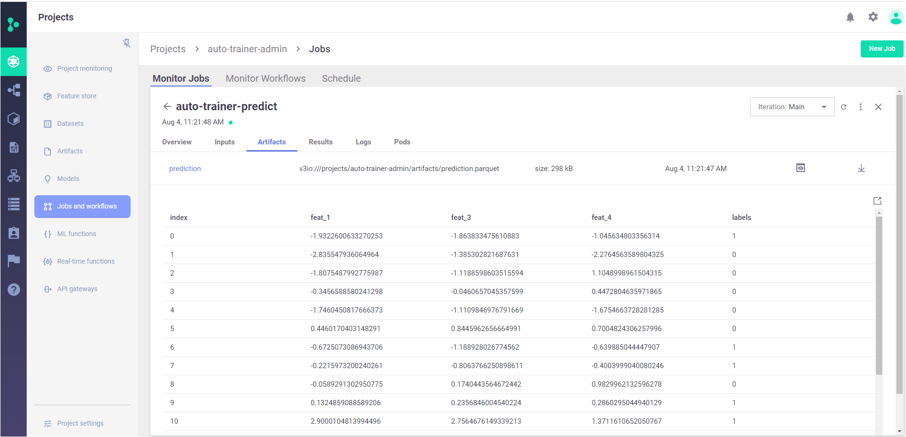
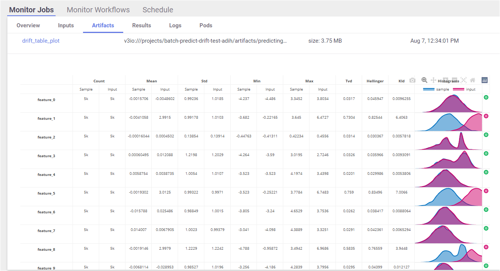

# Batch inference 

This topic describes how to run a batch predict job along with drift analysis.

## Overview

Batch inference or offline inference addresses the need to run machine learning model on large datasets.  

Batch, or offline, inference is the process of generating predictions on a batch of observations. The batch jobs are typically generated on some a schedule (e.g. 
hourly, daily). These predictions are then stored in a database or a file and can be made available to developers or end users. Batch inference can also take 
advantage of big data technologies, such as Spark, to generate predictions. This allows data scientists and machine learning engineers to take advantage of scalable 
compute resources to generate many predictions at once. As opposed to real time inference (where the goal is usually to optimize the number of transactions per 
second that the model can process), the goal of batch inference is usually tied to time constraints and the service-level agreement (SLA) for the job. 
In addition, the output of batch inference goes to a file or a table in a database vs. sending a response back to an online application.

## Auto-traininer function for prediction

The [Auto-trainer](https://www.mlrun.org/marketplace/functions/master/auto_trainer/latest/example/) is a function in the mlrun marketplace that is used for both 
training and prediction. This function saves you the need to write your own predict function, and it also runs a drift analysis by default. 
The drift compares the prediction data with the sample/test dataset.
To run batch predict you should use the predict handler.

The function supports the following frameworks:
* XGBoost
* sklearn
* LightGBM  

These are the parameters for running the function:
* `input` &mdash; Can be either be a URI, a FeatureVector or a sample in a shape of a list/dict.
* `model` &mdash; The model Store path.
* `label column` &mdash; The target label(s) of the column(s) in the dataset. for Regression or Classification tasks.
* `drop column` (optional) &mdash; str/int or a list of strings/ints that represent the column names/indices to drop. When the dataset is a list/dict, this parameter should be represented by integers.
* `result_set` &mdash; the name of the artifact with the result dataset.
* `param sample_set_statistics` (optional) &mdash; The statistics of the sample set logged along a model.
* `drift_threshold` (optional) &mdash; The threshold at which to mark drifts. Defaults to 0.7.
* `possible_drift_threshold` (optional) &mdash; The threshold at which to mark possible drifts. Defaults to 0.5.

The output of the model is saved, by default, to the project artifact path. You can change it by changing the `artifact_path` parameters when you run the job. See {ref}`artifacts`.


```python
import mlrun
```


```python
mlrun.get_or_create_project('batch-inference', context="./", user_project=True)
```

### Import the auto-traininer function from the marketplace


```python
auto_trainer = mlrun.import_function("hub://auto_trainer")
```

### Input the dataset

This example uses using a csv file (stored on wassabi object store) as an input dataset for the prediction.

```python
DATASET_URL = 'https://s3.wasabisys.com/iguazio/data/function-marketplace-data/xgb_trainer/classifier-data.csv'
```

```python
mlrun.get_dataitem(DATASET_URL).show()
```

<div>
<style scoped>
    .dataframe tbody tr th:only-of-type {
        vertical-align: middle;
    }

    .dataframe tbody tr th {
        vertical-align: top;
    }

    .dataframe thead th {
        text-align: right;
    }
</style>
<table border="1" class="dataframe">
  <thead>
    <tr style="text-align: right;">
      <th></th>
      <th>feat_0</th>
      <th>feat_1</th>
      <th>feat_2</th>
      <th>feat_3</th>
      <th>feat_4</th>
      <th>labels</th>
    </tr>
  </thead>
  <tbody>
    <tr>
      <th>0</th>
      <td>-0.265115</td>
      <td>-1.932260</td>
      <td>0.303992</td>
      <td>-1.863833</td>
      <td>-1.045635</td>
      <td>1</td>
    </tr>
    <tr>
      <th>1</th>
      <td>-3.135479</td>
      <td>-2.835548</td>
      <td>1.338381</td>
      <td>-1.385303</td>
      <td>-2.276456</td>
      <td>0</td>
    </tr>
    <tr>
      <th>2</th>
      <td>-1.519005</td>
      <td>-1.807549</td>
      <td>0.697304</td>
      <td>-1.118860</td>
      <td>1.104900</td>
      <td>0</td>
    </tr>
    <tr>
      <th>3</th>
      <td>-0.632087</td>
      <td>-0.345659</td>
      <td>0.244329</td>
      <td>-0.046066</td>
      <td>0.447280</td>
      <td>0</td>
    </tr>
    <tr>
      <th>4</th>
      <td>-1.405883</td>
      <td>-1.746045</td>
      <td>0.653617</td>
      <td>-1.110985</td>
      <td>-1.675466</td>
      <td>0</td>
    </tr>
    <tr>
      <th>...</th>
      <td>...</td>
      <td>...</td>
      <td>...</td>
      <td>...</td>
      <td>...</td>
      <td>...</td>
    </tr>
    <tr>
      <th>9995</th>
      <td>-2.641530</td>
      <td>-2.597802</td>
      <td>1.151097</td>
      <td>-1.382713</td>
      <td>-0.253170</td>
      <td>0</td>
    </tr>
    <tr>
      <th>9996</th>
      <td>-0.116548</td>
      <td>-0.903265</td>
      <td>0.139706</td>
      <td>-0.874907</td>
      <td>1.011517</td>
      <td>0</td>
    </tr>
    <tr>
      <th>9997</th>
      <td>4.699669</td>
      <td>2.120651</td>
      <td>-1.765963</td>
      <td>-0.121263</td>
      <td>-0.674961</td>
      <td>1</td>
    </tr>
    <tr>
      <th>9998</th>
      <td>1.151971</td>
      <td>0.991788</td>
      <td>-0.486083</td>
      <td>0.457369</td>
      <td>-1.734896</td>
      <td>1</td>
    </tr>
    <tr>
      <th>9999</th>
      <td>-0.665400</td>
      <td>-1.157263</td>
      <td>0.346660</td>
      <td>-0.867286</td>
      <td>-1.903681</td>
      <td>0</td>
    </tr>
  </tbody>
</table>
<p>10000 rows × 6 columns</p>
</div>


Next, drop the label column:


```python
sample = mlrun.get_dataitem(DATASET_URL).as_df().head().drop("labels", axis=1)
```


```python
sample = sample.values.tolist()
sample
```


    [[-0.2651151839702463,
      -1.9322600633270253,
      0.3039917127899224,
      -1.863833475610883,
      -1.045634803356314],
     [-3.1354794002707846,
      -2.835547936064964,
      1.3383808404873596,
      -1.385302821687631,
      -2.2764563589804325],
     [-1.519004884164945,
      -1.8075487992775987,
      0.6973035703821813,
      -1.1188598603515594,
      1.1048998961504315],
     [-0.6320867871545256,
      -0.3456588580241298,
      0.2443294437742147,
      -0.0460657045357599,
      0.4472804635971865],
     [-1.405882596126037,
      -1.7460450817666373,
      0.6536171315150338,
      -1.1109846976791669,
      -1.6754663728281285]]


## Run prediction

You can either use a trained model that is already registered in MLRun or just pass the model URI:


```python
model_path = 'store://artifacts/auto-trainer-admin/MyModel:cf9538d81a2a4ce9a2035ad3d8b90456'
```

### Making a prediction

Choosing the `predict` handler with all other paramters as described above:


```python
result_set = 'my_result'
```


```python
predict_run = auto_trainer.run(
    params={
        "dataset": sample,
        "model": model_path,
        "drop_columns": [0, 2], 
        "label_columns": "labels",
        "result_set": result_set,
    },
    handler="predict",
    local=False,
)
```

    > 2022-08-11 06:00:54,097 [info] starting run auto-trainer-predict uid=b13cb0f4bc794771819500ae146dffa7 DB=http://mlrun-api:8080
    > 2022-08-11 06:00:54,328 [info] Job is running in the background, pod: auto-trainer-predict-g8svg
    > 2022-08-11 06:00:59,974 [info] making prediction by 'MyModel'
    > 2022-08-11 06:01:00,104 [info] run executed, status=completed
    X does not have valid feature names, but RandomForestClassifier was fitted with feature names
    final state: completed


<style>
.dictlist {
  background-color: #4EC64B;
  text-align: center;
  margin: 4px;
  border-radius: 3px; padding: 0px 3px 1px 3px; display: inline-block;}
.artifact {
  cursor: pointer;
  background-color: #4EC64B;
  text-align: left;
  margin: 4px; border-radius: 3px; padding: 0px 3px 1px 3px; display: inline-block;
}
div.block.hidden {
  display: none;
}
.clickable {
  cursor: pointer;
}
.ellipsis {
  display: inline-block;
  max-width: 60px;
  white-space: nowrap;
  overflow: hidden;
  text-overflow: ellipsis;
}
.master-wrapper {
  display: flex;
  flex-flow: row nowrap;
  justify-content: flex-start;
  align-items: stretch;
}
.master-tbl {
  flex: 3
}
.master-wrapper > div {
  margin: 4px;
  padding: 10px;
}
iframe.fileview {
  border: 0 none;
  height: 100%;
  width: 100%;
  white-space: pre-wrap;
}
.pane-header-title {
  width: 80%;
  font-weight: 500;
}
.pane-header {
  line-height: 1;
  background-color: #4EC64B;
  padding: 3px;
}
.pane-header .close {
  font-size: 20px;
  font-weight: 700;
  float: right;
  margin-top: -5px;
}
.master-wrapper .right-pane {
  border: 1px inset silver;
  width: 40%;
  min-height: 300px;
  flex: 3
  min-width: 500px;
}
.master-wrapper * {
  box-sizing: border-box;
}
</style><script>
function copyToClipboard(fld) {
    if (document.queryCommandSupported && document.queryCommandSupported('copy')) {
        var textarea = document.createElement('textarea');
        textarea.textContent = fld.innerHTML;
        textarea.style.position = 'fixed';
        document.body.appendChild(textarea);
        textarea.select();

        try {
            return document.execCommand('copy'); // Security exception may be thrown by some browsers.
        } catch (ex) {

        } finally {
            document.body.removeChild(textarea);
        }
    }
}
function expandPanel(el) {
  const panelName = "#" + el.getAttribute('paneName');
  console.log(el.title);

  document.querySelector(panelName + "-title").innerHTML = el.title
  iframe = document.querySelector(panelName + "-body");

  const tblcss = `<style> body { font-family: Arial, Helvetica, sans-serif;}
    #csv { margin-bottom: 15px; }
    #csv table { border-collapse: collapse;}
    #csv table td { padding: 4px 8px; border: 1px solid silver;} </style>`;

  function csvToHtmlTable(str) {
    return '<div id="csv"><table><tr><td>' +  str.replace(/[\n\r]+$/g, '').replace(/[\n\r]+/g, '</td></tr><tr><td>')
      .replace(/,/g, '</td><td>') + '</td></tr></table></div>';
  }

  function reqListener () {
    if (el.title.endsWith(".csv")) {
      iframe.setAttribute("srcdoc", tblcss + csvToHtmlTable(this.responseText));
    } else {
      iframe.setAttribute("srcdoc", this.responseText);
    }
    console.log(this.responseText);
  }

  const oReq = new XMLHttpRequest();
  oReq.addEventListener("load", reqListener);
  oReq.open("GET", el.title);
  oReq.send();


  //iframe.src = el.title;
  const resultPane = document.querySelector(panelName + "-pane");
  if (resultPane.classList.contains("hidden")) {
    resultPane.classList.remove("hidden");
  }
}
function closePanel(el) {
  const panelName = "#" + el.getAttribute('paneName')
  const resultPane = document.querySelector(panelName + "-pane");
  if (!resultPane.classList.contains("hidden")) {
    resultPane.classList.add("hidden");
  }
}

</script>
<div class="master-wrapper">
  <div class="block master-tbl"><div>
<style scoped>
    .dataframe tbody tr th:only-of-type {
        vertical-align: middle;
    }

    .dataframe tbody tr th {
        vertical-align: top;
    }

    .dataframe thead th {
        text-align: right;
    }
</style>
<table border="1" class="dataframe">
  <thead>
    <tr style="text-align: right;">
      <th>project</th>
      <th>uid</th>
      <th>iter</th>
      <th>start</th>
      <th>state</th>
      <th>name</th>
      <th>labels</th>
      <th>inputs</th>
      <th>parameters</th>
      <th>results</th>
      <th>artifacts</th>
    </tr>
  </thead>
  <tbody>
    <tr>
      <td>batch-inference-admin</td>
      <td><div title="b13cb0f4bc794771819500ae146dffa7"><a href="https://dashboard.default-tenant.app.product-3-4-2.iguazio-cd0.com/mlprojects/batch-inference-admin/jobs/monitor/b13cb0f4bc794771819500ae146dffa7/overview" target="_blank" >...146dffa7</a></div></td>
      <td>0</td>
      <td>Aug 11 06:00:59</td>
      <td>completed</td>
      <td>auto-trainer-predict</td>
      <td><div class="dictlist">v3io_user=admin</div><div class="dictlist">kind=job</div><div class="dictlist">owner=admin</div><div class="dictlist">mlrun/client_version=1.0.4</div><div class="dictlist">host=auto-trainer-predict-g8svg</div></td>
      <td></td>
      <td><div class="dictlist">dataset=[[-0.2651151839702463, -1.9322600633270253, 0.3039917127899224, -1.863833475610883, -1.045634803356314], [-3.1354794002707846, -2.835547936064964, 1.3383808404873596, -1.385302821687631, -2.2764563589804325], [-1.519004884164945, -1.8075487992775987, 0.6973035703821813, -1.1188598603515594, 1.1048998961504315], [-0.6320867871545256, -0.3456588580241298, 0.2443294437742147, -0.0460657045357599, 0.4472804635971865], [-1.405882596126037, -1.7460450817666373, 0.6536171315150338, -1.1109846976791669, -1.6754663728281285]]</div><div class="dictlist">model=store://artifacts/auto-trainer-admin/MyModel:cf9538d81a2a4ce9a2035ad3d8b90456</div><div class="dictlist">drop_columns=[0, 2]</div><div class="dictlist">label_columns=labels</div><div class="dictlist">result_set=my_result</div></td>
      <td></td>
      <td><div title="v3io:///projects/batch-inference-admin/artifacts/my_result.parquet">my_result</div></td>
    </tr>
  </tbody>
</table>
</div></div>
  <div id="resultf96b3f2d-pane" class="right-pane block hidden">
    <div class="pane-header">
      <span id="resultf96b3f2d-title" class="pane-header-title">Title</span>
      <span onclick="closePanel(this)" paneName="resultf96b3f2d" class="close clickable">&times;</span>
    </div>
    <iframe class="fileview" id="resultf96b3f2d-body"></iframe>
  </div>
</div>


    


<b> > to track results use the .show() or .logs() methods  or <a href="https://dashboard.default-tenant.app.product-3-4-2.iguazio-cd0.com/mlprojects/batch-inference-admin/jobs/monitor/b13cb0f4bc794771819500ae146dffa7/overview" target="_blank">click here</a> to open in UI</b>
> 2022-08-11 06:01:00,573 [info] run executed, status=completed


#### Showing the prediction results


```python
predict_run.outputs
```

{'my_result': 'store://artifacts/batch-inference-admin/my_result:b13cb0f4bc794771819500ae146dffa7'}

```python
predict_run.artifact(result_set).show()
```


<div>
<style scoped>
    .dataframe tbody tr th:only-of-type {
        vertical-align: middle;
    }

    .dataframe tbody tr th {
        vertical-align: top;
    }

    .dataframe thead th {
        text-align: right;
    }
</style>
<table border="1" class="dataframe">
  <thead>
    <tr style="text-align: right;">
      <th></th>
      <th>1</th>
      <th>3</th>
      <th>4</th>
      <th>labels</th>
    </tr>
  </thead>
  <tbody>
    <tr>
      <th>0</th>
      <td>-1.932260</td>
      <td>-1.863833</td>
      <td>-1.045635</td>
      <td>1</td>
    </tr>
    <tr>
      <th>1</th>
      <td>-2.835548</td>
      <td>-1.385303</td>
      <td>-2.276456</td>
      <td>0</td>
    </tr>
    <tr>
      <th>2</th>
      <td>-1.807549</td>
      <td>-1.118860</td>
      <td>1.104900</td>
      <td>0</td>
    </tr>
    <tr>
      <th>3</th>
      <td>-0.345659</td>
      <td>-0.046066</td>
      <td>0.447280</td>
      <td>0</td>
    </tr>
    <tr>
      <th>4</th>
      <td>-1.746045</td>
      <td>-1.110985</td>
      <td>-1.675466</td>
      <td>0</td>
    </tr>
  </tbody>
</table>
</div>


### View the results in the UI 

The output is saved as a parquet file under the project artifact path.
In the UI, go to the prediction job --> Artifacts tab to view the details.



### How to scehdule a batch job

To schedule a job, set the schedule parameter of the run method. The scheduling is done by using a crontab format.

You can also schedule jobs from the dashboard. On the **Projects > Jobs and Workflows** page, you can create a new job using the **New Job** wizard. At the end of the wizard you can set the job scheduling. In the following example, the job is set to run every 30 minutes.


```python
predict_run = auto_trainer.run(
    params={
        "dataset": sample,
        "model": model_path,
        "drop_columns": [0, 2],
        "label_columns": "labels",
    },
    handler="predict",
    local=False,
    schedule='*/30 * * * *'
)
```

> 2022-08-11 06:01:09,183 [info] starting run auto-trainer-predict uid=9310360c64744c29991d1145d04d55e5 DB=http://mlrun-api:8080
> 2022-08-11 06:01:09,456 [info] task scheduled, {'schedule': '*/30 * * * *', 'project': 'batch-inference-admin', 'name': 'auto-trainer-predict'}


## Viewing the drift result

By default, the auto_trainer function analyzes drift by comparing the input and the sample dataset statistics.  
It triggers a drift analysis job that generates 3 output files that can be viewed under the **Artifacts** tab for the prediction job:
* drift_table_plot &mdash; shows expected vs. actual statistics for every feature as a plot.
* drift_results &mdash; shows the drift result per feature as a JSON format so you can use it to process this data and apply your logic on top of it.
* dataset_statistics &mdash; shows the statistics of the input dataset.

### Drift table plot example


