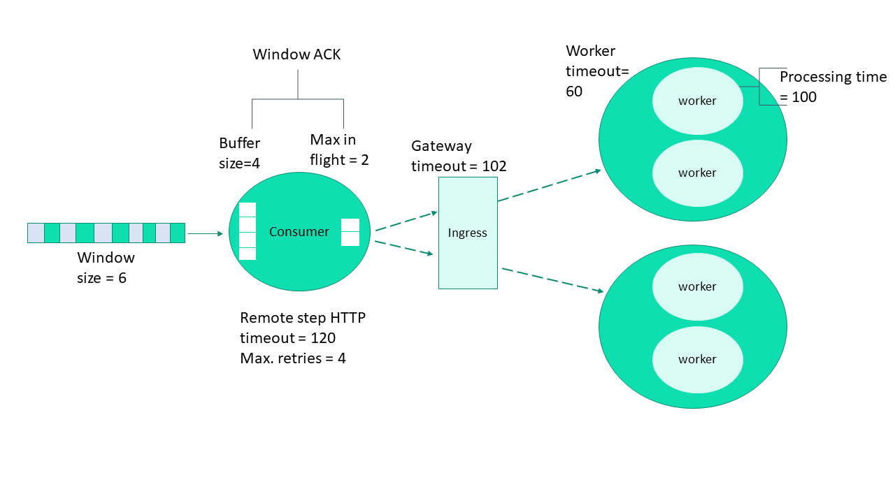

(graph-ha-cfg)=
# Serving graph high availability configuration

This figure illustrates a simplistic flow of an MLRun serving graph with remote invocation:

As explained in {ref}`serving-graph`, the serving graph is based on Nuclio functions. 

**In this section**
- [Using Nuclio with stream triggers](#using-Nuclio-with-stream-triggers)
- [Consumer function configuration](#consumer-function-configuration)
- [Remote function retry mechanism](#remote-function-retry-mechanism)
- [Configuration considerations](#configuration-considerations)
 
## Using Nuclio with stream triggers

Nuclio can use different trigger types. When used with stream triggers, such as Kafka and V3IO, it uses a consumer group to 
continue reading from the last processed offset on function restart. This provides the "at least once" semantics for stateless functions. 
However, if the function does have state, such as persisting a batch of events to storage (e.g. parquet files, database) or if the function 
performs additional processing of events after the function handler returns, then the flow can get into situations where events seem to be 
lost. The mechanism of Window ACK provides a solution for such 
stateful event processing.

With Window ACK, the consumer group's committed offset is delayed by one window, committing the offset at (processed event num – window). 
When the function restarts (for any reason including scale-up or scale-down), it starts consuming from this last committed point. 

The size of the required Window ACK is based on the number of events that could be in processing when the function terminates. You can 
define a window ACK per trigger (Kafka, V3IO stream, etc.). When used with a serving graph, the appropriate Window ACK size depends on the 
graph structure and should be calculated accordingly. The following sections explain the relevant considerations.

## Consumer function configuration

A consumer function is essentially a Nuclio function with a stream trigger. As part of the trigger, you can set a consumer group.  

When the consumer function is part of a graph then the consumer function’s number of replicas is derived from the number of shards and is 
therefore nonconfigurable. The same applies to the number of workers in each replica, which is set to 1 and is not configurable.  

The consumer function has one buffer per worker, measured in number of messages, holding the incoming events that were received by the worker and are waiting to be 
processed. Once this buffer is full, events need to be processed so that the function is able to receive more events. The buffer size is 
configurable and is key to the overall configuration. 

The buffer should be as small as possible. There is a trade-off between the buffer size and the latency. A larger buffer has lower latency 
but increases the recovery time after a failure, due to the high number of records that need to be reprocessed.  
To set the buffer size: 

`function.spec.parameters["source_args"] = {"buffer_size": 1}`

The default `buffer_size` is 8 (messages).

## Remote function retry mechanism 

The required processing time of a remote function varies, depending on the function. The system assumes a processing 
time in the order of seconds, which affects the default configurations. However, some functions require a longer processing time. 
You can configure the timeout on both the caller and on the remote, as appropriate for your functions.

When an event is sent to the remote function, and no response is received by the configured (or default) timeout, or an error 500 
(the remote function failed), or error 502, 503, or 504 (the remote function is too busy to handle the request at this time) is received, 
the caller retries the request, using the platform's exponential retry backoff mechanism. 
If the number of caller retries reaches the configured maximum number of retries, the event is pushed to the exception stream, indicating 
that this `event` did not complete successfully. You can look at the exception stream to see the functions that did not complete successfully.

### Remote-function caller configuration

In a simplistic flow these are the consumer function defaults:

- Maximum retries: The default is 6, which is equivalent to about 3-4 minutes if all of the related parameters 
are at their default values. If you expect that some cases will require a higher number, for example, a new node needs to be scaled up 
depending on your cloud vendor, the instance type, and the zone you are running in, you might want to increase the number of retries. 
- Remote step http timeout: The time interval the caller waits for a response from the remote before retrying the request. This value is 
affected by the remote function processing time.
- Max in flight: The maximum number of requests that each caller worker can send in parallel to the remote function. 
If the caller has more than one worker, each worker has its own Max in flight.

To set Max in flight, timeout, and retries: 

`RemoteStep(name=”remote_scale”, …, max_in_flight=2, timeout=100, retries=10)`

### Remote-function configuration

For the remote function, you can configure the following:

- Worker timeout: The maximum time interval, in seconds, an incoming request waits for an available worker. The worker timeout must be
shorter than the gateway timeout. The default is 10.
- Gateway timeout: The maximum time interval, in seconds, the gateway waits for a response to a request. This determines when the ingress 
times out on a request. It must be slightly longer than the expected function processing time. The default is 60.

To set the buffer gateway timeout and worker timeout:

`my_serving_func.with_http(gateway_timeout=125, worker_timeout=60)`

## Configuration considerations

The following figure zooms in on a single consumer and its workers and illustrates the various concepts 
and parameters that provide high availability, using a non-default configuration.

- Assume the processing time of the remote function is Pt, in seconds. 
- `timeout`: Between <Pt+epsilon> and <Pt+`worker_timeout`>.
- Serving function 
   - `gateway_timeout`: Pt+1 second (usually sufficient).
   - `worker_timeout`: The general rule is the greater of Pt/10 or 60 seconds. However, you should adjust the 
   value according to your needs.
- `max_in_flight`: If the processing time is very high then `max_in_flight` should be low. Otherwise, there will be many retries.
- `ack_window_size`: 
   - With 1 worker: The consumer `buffer_size`+`max_in_flight`, since it is per each shard and there is a single worker. 
   - With >1 worker: The consumer (#workers x `buffer_size`)+`max_in_flight`

Make sure you thoroughly understand your serving graph and its functions before defining the `ack_window_size`. Its value depends on the 
entire graph flow. You need to understand which steps are parallel (branching) vs. sequential invocation. Another key aspect is that the number of workers affects the window size.
      
See the [ack_window_size API](../api/mlrun.runtimes.html#mlrun.runtimes.RemoteRuntime.add_v3io_stream_trigger).

For example:  
- If a graph includes: consumer -> remote r1 -> remote r2:
   - The window should be the sum of: consumer’s `buffer_size` + `max_in_flight` to r1 + `max_in_flight` to r2. 
- If a graph includes: calling to remote r1 and r2 in parallel:
   - The window should be set to: consumer’s `buffer_size` + max (`max_in_flight` to r1, `max_in_flight` to r2).
