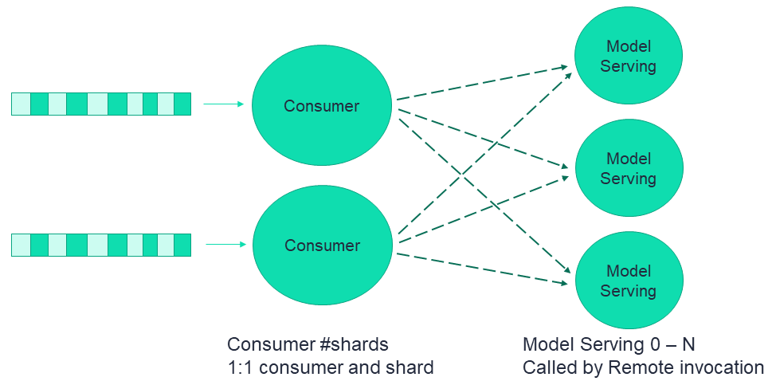

# Serving graph high availability configuration

This section describes the processing of the serving graph HA in MLRun, and how to configure it. 

This figure illustrates a simplistic flow of an MLRun serving graph with remote invocation:


As explained in [MLRun Serving Graphs](./serving-graph.md), the serving graph is based on Nuclio functions. 
 
## Using Nuclio with stream triggers

Nuclio can be used with different trigger types. When used with stream triggers, such as Kafka and V3io, it utilizes a consumer group 
concept whereby a record that was already consumed is not consumed again upon a restart of the function. This provides an “at least once” 
processing method for stateless functions. However, if the function does have state, such as persisting a batch of events to storage (for 
example, parquet files, database) or if the function performs additional processing to the events after the function handler completes its 
process, then the flow can get into situations where events seem to be lost. The mechanism of Window ACK provides a solution for such 
stateful event processing. 

With Window ACK, the consumer group committed offset is always one window away, committing to: (processed event num – window). When the 
function restarts (for any reason including scale-up or scale-down), it starts consuming from this last committed point. 

The size of the required Window ACK is based on the number of events that could be in process. You can define a window ACK per trigger 
(Kafka, v3io stream, etc.). When used with a serving graph, the appropriate Window ACK size depends on the graph structure and 
should be calculated accordingly. The following sections explain the considerations to be used.

## Consumer function configuration

A consumer function is essentially a Nuclio function with a stream trigger. As part of the trigger, you can set a consumer group.  

When the consumer function is part of a graph then the consumer function’s number of replicas is derived from the number of shards and is therefore non-configurable. The same applies to the number of workers on each replica, which is set to one and is not configurable.  

The consumer function has a buffer per worker holding the incoming events that can be received by the worker but not yet processed. 
The buffer size is configurable and is key to the overall configuration. Once this buffer is full, events need to be processed 
so that the function is able to receive more events. 

The buffer should be as small as possible. There is a trade-off between the buffer size and the latency. A larger buffer has lower latency 
but increases the recovery time after a failure, due to the high number of flows that need to be reprocessed. </br>
To set the buffer size: 

`function.spec.parameters["source_args"] = {"buffer_size": 1}`

<!-- add updated link to function.spec.parameters when graphs content is in build:  -->
The default `buffer_size` is 8.

```{admonition} Note
In the above example the consumer function has a single worker, but in cases where a function has multiple workers, each worker has its own buffer. 
``` 

## Remote function retry mechanism 

The required processing time of a remote function varies, depending on the function. The system assumes a processing 
time in the order of seconds, which affects the default configurations. However, some functions require a longer processing time, 
thus you can configure the timeout on both the caller and on the remote, as appropriate for your functions.

When an event is sent to the remote function, and no response is received by the provided timeout (or the default one), or an error 500,
502, 503, or 504 is received (the remote function is too busy to handle the request at this time), 
the caller retries the request up to the configured maximum number of retries, using an exponential retry backoff mechanism. 
If the number of retries is reached, the event is pushed to the exception stream, indicating that this `triggers.(name).
event` did not complete successfully.

### Remote-function caller configuration

In a simplistic flow this is the consumer function:

- Maximum retries: The default is 6, which is equivalent to about 3-4 minutes if all of the related parameters 
are at their default values. If you expect that there could be cases where a higher number
is needed, for example, a new node needs to be scaled up depending on your cloud vendor, the instance type, and the zone you are
running on, you might want to increase the number of retries. 
- Remote step http timeout: The time interval the caller waits for a response from the remote before retrying the request. This is affected 
by the remote function processing time.
- Max in flight: The number of in-flight requests that can be sent in parallel from each caller worker towards the remote function. 
If the caller has more than one worker, each worker has its own max in flight. When the max retries is reached, then the event is pushed 
into the exception stream. You can look at the exception stream to see the functions that didn’t successfully complete.

To set the buffer max-in-flight, timeout, and retries: 

`RemoteStep(name=”remote_scale”, ….,max_in_flight=2,timeout=100,retries = 10)`

### Remote-function configuration

On the remote function, you can configure the following:

- Worker timeout: The time interval, in seconds, an arriving request waits for an available worker. The worker timeout must be shorter than 
the gateway timeout. The default is 10. 
- Gateway timeout: The time interval, in seconds, the gateway waits for the end of a request. This determines when the ingress times out on 
a request. It must be slightly longer than the expected function processing time. The default is 60.

To set the buffer gateway timeout and worker timeout:

`My_serving_func.with_http(gateway_timeout=125, worker_timeout=60)`

<a id="configuration-considerations"></a>
## Configuration considerations

The following figure zooms in on a single consumer and its workers and illustrates the various concepts 
and parameters that provide high availability, using a non-default configuration.


- Assume the processing time of the remote function is Pt, in seconds. 
- Timeout: Pt + 1 second (usually sufficient).
- Serving function 
   - `gateway_timeout`: Pt + 1 second (usually sufficient).
   - `worker_timeout`: The general rule of thumb is the greater of Pt/10 or 60 seconds. However you should adjust the 
   value according to your needs.
- `max_in_flight`: If the processing time is very high then `max_in_flight` should not be very high. Otherwise, there will be many retries.
- `ack_window_size`: The consumer buffer size + max_in_flight, since it is per each shard and there is a single worker. See [ack_window_size](../api/mlrun.runtimes.html#mlrun.runtimes.RemoteRuntime.add_v3io_stream_trigger).

You should pay great attention when defining the `ack_window_size`. It depends on the entire graph flow, and you need to understand when 
steps are done in parallel (branching) vs. sequential invocation. Another key aspect is that the number of workers should also affect 
the window size.

For example:  
- If a graph includes: consumer -> remote r1 -> remote r2  
   - The window should be the sum of: consumer’s buffer size + MIF to r1 + MIF to r2. 
- If a graph includes: calling to remote r1 and r2 in parallel 
   - The window should be set to: consumer’s buffer size + max (MIF to r1, MIF to r2)  
