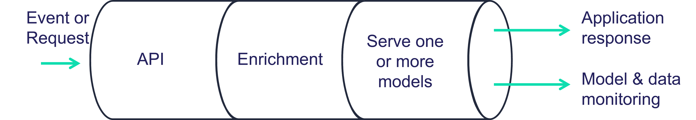

(serving-graph)=
# Real-time serving pipelines (graphs)

MLRun graphs enable building and running DAGs (directed acyclic graph). 

MLRun graph capabilities include:

- Easy to build and deploy distributed real-time computation graphs
- Use the real-time serverless engine (Nuclio) for auto-scaling and optimized resource utilization
- Built-in operators to handle data manipulation, IO, machine learning, deep-learning, NLP, etc.
- Built-in monitoring for performance, resources, errors, data, model behaviour, and custom metrics
- Debug in the IDE/Notebook

Graphs are composed of individual steps. 
The first graph element accepts an `Event` object, transforms/processes the event and passes the result to the next steps
in the graph. The final result can be written out to some destination (file, DB, stream, etc.) or returned back to the caller
(one of the graph steps can be marked with `.respond()`). 

The serving graphs can be composed of [pre-defined graph steps](./available-steps.html), block-type elements (model servers, routers, ensembles, 
data readers and writers, data engineering tasks, validators, etc.), [custom steps](./writing-custom-steps.html), or from native python 
classes/functions. A graph can have data processing steps, model ensembles, model servers, post-processing, etc. (see the [Advanced Model Serving Graph Notebook Example](./graph-example.html)). Graphs can auto-scale and span multiple function containers (connected through streaming protocols).


  
Different steps can run on the same local function, or run on a remote function. You can call existing functions from the graph and reuse 
them from other graphs, as well as scale up and down the different components individually.

Graphs can run inside your IDE or Notebook for test and simulation. Serving graphs are built on 
top of [Nuclio](https://github.com/nuclio/nuclio) (real-time serverless engine), [MLRun jobs](../concepts/jobs.html), 
[MLRun Storey](<https://github.com/mlrun/storey>) (native Python async and stream processing engine), 
and other MLRun facilities. 

The serving graphs are used by [MLRun’s Feature Store](../feature-store/feature-store.html) to build real-time feature engineering pipelines. 

**In this section**

```{toctree}
:maxdepth: 1
  
getting-started
use-cases
realtime-pipelines
model-serving-get-started
writing-custom-steps
available-steps
demos
graph-ha-cfg
pipelines-error-handling
```
