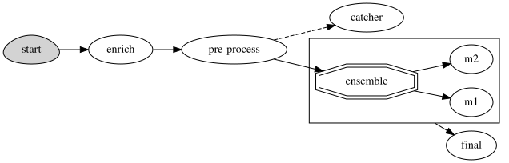

(use-cases-serving)=
# Examples of serving graphs

Learn how serving graphs can simplify complex workflows as illustrated in these examples.

<!-- ## Data preparation, ## Model serving -->

**In this section**
* [Simple model serving router ](#simple-model-serving-router-example)
* [Advanced data processing and serving ensemble example](#advanced-data-processing-and-serving-ensemble-example)
* [NLP processing pipeline with real-time streaming example](#nlp-processing-pipeline-with-real-time-streaming-example)
* [Cyclic graph example](#cyclic-graph-example)
* [Data and feature engineering](#data-and-feature-engineering-using-the-feature-store)

In addition to the examples in this section, see the:
- [Distributed (multi-function) pipeline example](./distributed-graph.ipynb) that details how to run a pipeline that consists of multiple serverless functions (connected using streams).
- [Advanced model serving graph notebook example](./graph-example.ipynb) that illustrates the flow, task, model, and ensemble router states; building tasks from custom handlers; classes and storey components; using custom error handlers; testing graphs locally; deploying a graph as a real-time serverless function.
- {ref}`MLRun demos <demos>` for additional use cases and full end-to-end examples, including GenAI serving.

## Simple model serving router example

Graphs are used for serving models with different transformations.

To deploy a serving function, you need to import or create the serving function, 
add models to it, and then deploy it.  

```python
import mlrun

# load the sklearn model serving function and add models to it
fn = mlrun.import_function("hub://v2_model_server")
fn.add_model("model1", model_path={model1 - url})
fn.add_model("model2", model_path={model2 - url})

# deploy the function to the cluster
fn.deploy()

# test the live model endpoint
fn.invoke("/v2/models/model1/infer", body={"inputs": [5]})
```

The serving function supports the same protocol used in KFServing V2 and Triton Serving framework. 
To invoke the model, use the following url: `<function-host>/v2/models/model1/infer`.

See the [**serving protocol specification**](./model-api.md) for details.

```{note}
Model url is either an MLRun model store object (starts with `store://`) or URL of a model directory 
(in NFS, s3, v3io, azure, for example `s3://{bucket}/{model-dir}`). Note that credentials might need to 
be added to the serving function via environment variables or MLRun secrets.
```

See the [**scikit-learn classifier example**](https://github.com/mlrun/functions/blob/master/functions/src/sklearn_classifier/sklearn_classifier.ipynb), 
which explains how to create/log MLRun models.

### Writing your own serving class

You can implement your own model serving or data processing classes. All you need to do is:

1. Inherit the base model serving class.
2. Add your implementation for model `load()` (download the model file(s) and load the model into memory). 
2. `predict()` (accept the request payload and return the prediction/inference results).

You can override additional methods: `preprocess`, `validate`, `postprocess`, `explain`.<br>
You can add custom API endpoints by adding the method `op_xx(event)` (which can be invoked by
calling the `<model-url>/xx`, where operation = xx). See {py:class}`~mlrun.model`.

For an example of writing the minimal serving functions, see [Minimal sklearn serving function example](./custom-model-serving-class.md#minimal-sklearn-serving-function-example).

See the full [V2 Model Server (SKLearn) example](https://github.com/mlrun/functions/blob/master/functions/src/v2_model_server/v2_model_server.ipynb) that 
tests one or more classifier models against a held-out dataset.

## Advanced data processing and serving ensemble example

MLRun serving graphs can host advanced pipelines that handle event/data processing, ML functionality, 
 or any custom task. The following example demonstrates an asynchronous pipeline that pre-processes data, 
passes the data into a model ensemble, and finishes off with post processing. 

**For a complete example, see the [Advanced graph example notebook](./graph-example.ipynb).**

Create a function of type serving from code and set the graph topology to `async flow`.

```python
import mlrun

project = mlrun.get_or_create_project("myproj")

function = project.set_function(
    "advanced",
    func="<path to demo.py>",
    kind="serving",
    image="mlrun/mlrun",
    requirements=["storey"],
)
graph = function.set_topology("flow", engine="async")
```

Build and connect the graph (DAG) using the custom function and classes and plot the result. 
Add steps using the `step.to()` method (adds a new step after the current one), or using the 
`graph.add_step()` method.

Use the graph `error_handler` if you want an error from the graph or a step to be fed into a specific state (catcher). See the full description in {ref}`pipelines-error-handling`.

Specify which step is the responder (returns the HTTP response) using the `step.respond()` method. 
If the responder is not specified, the graph is non-blocking.

```python
# use built-in storey class or our custom Echo class to create and link Task steps. Add an error handling step that runs only if the "Echo" step fails
graph.to("storey.Extend", name="enrich", _fn='({"tag": "something"})').to(
    class_name="Echo", name="pre-process", some_arg="abc"
).error_handler(name="catcher", handler="handle_error", full_event=True)

# add an Ensemble router with two child models (routes), the "*" prefix marks it as router class
router = graph.add_step(
    "*mlrun.serving.VotingEnsemble", name="ensemble", after="pre-process"
)
router.add_route("m1", class_name="ClassifierModel", model_path=path1)
router.add_route("m2", class_name="ClassifierModel", model_path=path2)

# add the final step (after the router), which handles post-processing and response to the client
graph.add_step(class_name="Echo", name="final", after="ensemble").respond()

# plot the graph (using Graphviz) and run a test
graph.plot(rankdir="LR")
```

<br><br>

Create a mock (test) server, and run a test. Use `wait_for_completion()` 
to wait for the async event loop to complete.
  
```python
server = function.to_mock_server()
resp = server.test("/v2/models/m2/infer", body={"inputs": data})
server.wait_for_completion()
``` 

And deploy the graph as a real-time Nuclio serverless function with one command:

    function.deploy()

```{note}
If you test a Nuclio function that has a serving graph with the async engine via the Nuclio UI, the UI might not display the logs in the output.
```

## NLP processing pipeline with real-time streaming example

In some cases it's useful to split your processing to multiple functions and use 
streaming protocols to connect those functions. In this example the data 
processing is in the first function/container and the NLP processing is in the second function. 
In this example the GPU is contained in the second function.

See the [full notebook example](./distributed-graph.ipynb).

```python
# define a new real-time serving function (from code) with an async graph
project = mlrun.get_or_create_project("myproj")

fn = project.set_function(
    "multi-func", func="<path to data_prep.py>", kind="serving", image="mlrun/mlrun"
)
graph = fn.set_topology("flow", engine="async")

# define the graph steps (DAG)
graph.to(name="load_url", handler="load_url").to(
    name="to_paragraphs", handler="to_paragraphs"
).to("storey.FlatMap", "flatten_paragraphs", _fn="(event)").to(
    ">>", "q1", path=internal_stream
).to(
    name="nlp", class_name="ApplyNLP", function="enrich"
).to(
    name="extract_entities", handler="extract_entities", function="enrich"
).to(
    name="enrich_entities", handler="enrich_entities", function="enrich"
).to(
    "storey.FlatMap", "flatten_entities", _fn="(event)", function="enrich"
).to(
    name="printer", handler="myprint", function="enrich"
).to(
    ">>", "output_stream", path=out_stream
)

# specify the "enrich" child function, add extra package requirements
child = fn.add_child_function("enrich", "./nlp.py", "mlrun/mlrun")
child.spec.build.commands = [
    "python -m pip install spacy",
    "python -m spacy download en_core_web_sm",
]
graph.plot()
```

Currently queues support Iguazio V3IO and Kafka streams.

## Exanple of a cyclic graph
In agentic systems, loops and iterative refinement are common architectural patterns. Typical use cases:
- Evaluator–Optimizer loop: An LLM generates a response, a secondary agent evaluates it, and if unsatisfactory, the generation is retried until quality improves or a cap is reached.
- Multi-agent orchestration: A controller agent invokes specialized sub-agents (retriever, summarizer, planner), then loops back to coordinate or refine based on their results.
- Guardrail enforcement: A safety or compliance step checks outputs and, on failure, routes control back to the generator until conditions are met.

Cycles are supported for graphs of `flow` topology and `async` engine (storey) with `kind` = `job` and `serving`. You can run it `to_mock_server` and `deploy()`.
Set a graph as cyclic using `allow_cyclic=True` in `set_topology`, or with `serving.spec.graph.allow_cyclic = True` after the graph is already defined.

Cycles can return to the same step, or cycle through multiple steps. Create a multi-step cycle by listing the step names and using `cycle_to`. (See {py:meth}`BaseStep to() <~mlrun.serving.states.BaseStep.to>`,  {py:meth}`QueueStep to()<~mlrun.serving.QueueStep.to>` and {py:meth}`~mlrun.serving.states.BaseStep.cycle_to`.) 
Example of creating a cycle from step 1 through to step 3, and back to step 1:
```python
graph.to("step1").to("step2").to("step3").cycle_to(["step1"])
```

Iteration tracking is automatic, you do not need to add counters manually in the step code. If you set `max_iterations` in `set_topology` and in `add_step`, the value in `add_step` takes precedence. The default number of iterations is 10_000.

```{admonition} Important
- If stop conditions (`max_iterations`) are misconfigured, cycles can lead to an infinite execution of graph steps.
- Rerunning steps in a loop can cause unexpected compute spikes and higher costs.
- Step failures inside a cycle could repeat continuously, amplifying errors.
Any of these issues make graph execution harder to debug and monitor, and
increase the risk of resource exhaustion (workers, memory, execution slots).
```

When a RuntimeError is raised:
- If you provided an error handler, the event invokes the error handler
- If you did not provide an error handler, the error is raised to the client
A typical error is `RuntimeError(f"Max iterations exceeded in step '{self.name}' for event {event.id}")`.

```python
# Define the function
function = project.set_function(
    name="cyclic-function",
    func="cyclic.py",
    kind="serving",
    image="mlrun/mlrun",
)
# Define the graph (global cap applies unless overridden per-step)
graph = function.set_topology(
    "flow", engine="async", allow_cyclic=True, max_iterations=100
)
graph.to(name="preprocess", class_name="Processor").to(
    name="generator", class_name="Generator", after="preprocess", max_iterations=30
).to(name="evaluator", class_name="Evaluator", after="generator").to(
    name="evaluation-loop",
    class_name="ChoiceHandler",
    cycle_to=["generator"],
    after="evaluator",
).to(
    name="output", handler="responder", after="evaluation-loop"
).respond()

# Adding error handler to the graph
graph.error_handler(class_name="HandleError")

# Mock server
mock = graph.to_mock_server()
mock.test("/", body={...})

# Kubernetes deployment
function.deploy()
function.invoke("/", body={...})
```


## Data and feature engineering (using the feature store)

You can build a feature set transformation using serving graphs.

High-level transformation logic is automatically converted to real-time serverless processing engines that can read 
from any online or offline source, handle any type of structures or unstructured data, run complex computation graphs 
and native user code. Iguazio’s solution uses a unique multi-model database, serving the computed features consistently 
through many different APIs and formats (like files, SQL queries, pandas, real-time REST APIs, time-series, streaming), 
resulting in better accuracy and simpler integration.

Read more in {ref}`feature-store`, and [Feature set transformations](../feature-store/transformations.md).