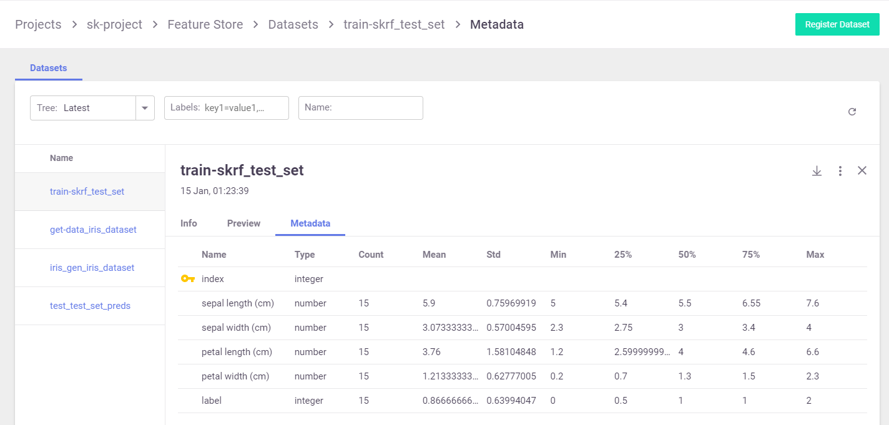

(artifacts)=
# Artifacts and Versioning <!-- omit in toc -->

- [Overview](#overview)
  - [Artifact Path](#artifact-path)
  - [Artifact URIs, Metadata and Versioning](#artifact-uris-metadata-and-versioning)
- [Datasets](#datasets)
  - [Logging a Dataset From a Job](#logging-a-dataset-from-a-job)
- [Plots](#plots)

## Overview

An artifact is any data that is produced and/or consumed by functions, jobs, or pipelines. 

Artifacts metadata is stored in the projects database, artifacts are divided to 4 main types:
1. **Files** — files, directories, images, figures, and plotlines.
2. **Datasets** — any data , such as tables and DataFrames.
3. **Models** — all trained models.
4. **Feature Store Objects** - Feature Sets and Feature Vectors

Artifacts can be viewed and manages in the UI, in the project page select the artifact type
`models`, `files`, or `feature-store` (for datasets and feature store objects).

Example dataset artifact screen:
<br><br>


You can search the artifacts based on time and labels.
You can view per artifact its location, the artifact type, labels, 
the producer of the artifact, the artifact owner, last update date, and type specific information.

Artifacts can also be viewed from the job page (in the `artifacts` tab).
Per each artifact you can view its content as well as download the artifact.

### Artifact Path

Jobs use the default or job specific `artifact_path` parameter to determine where they should store artifacts.
The default `artifact_path` can be specified at the cluster level, client level, project level or job level 
(at that precedence order) or can be specified as a parameter in the specific `log` operation.

You can set the default artifact_path for your environment using the {py:func}`~mlrun.set_environment` function.

You can override the default artifact_path configuration by setting the artifact_path parameter of 
the {py:func}`~mlrun.set_environment` function. You can use variables in the artifacts path, 
such as {{project}} for the name of the running project or {{run.uid}} for the current job/pipeline run UID. 
(The default artifacts path uses {{project}}.) The following example configures the artifacts path to an 
artifacts directory in the current active directory (./artifacts)

    set_environment(project=project_name, artifact_path='./artifacts')

```{admonition} For Iguazio Platform Users
In the Iguazio Data Science Platform, the default artifacts path is a <project name>/artifacts directory in the 
predefined “projects” data container — /v3io/projects/<project name>/artifacts 
(for example, /v3io/projects/myproject/artifacts for a “myproject” project).
```

When you use use `{{run.uid}}`, the artifacts for each job are stored in a dedicated directory for the executed job.
Otherwise, the same artifacts directory is used in all runs, so the artifacts for newer runs override those from the previous runs.

As previously explained, `set_environment` returns a tuple with the project name and artifacts path.
You can optionally save your environment's artifacts path to a variable, as demonstrated in the previous steps.
You can then use the artifacts-path variable to extract paths to task-specific artifact subdirectories.
For example, the following code extracts the path to the artifacts directory of a `training` task, and saves the path 
to a `training_artifacts` variable:

```python
import os
training_artifacts = os.path.join(artifact_path, 'training')
```

> **Note:** The artifacts path is using [data store URLs](./datastore.md) which are not necessarily local file paths 
> (for example, `s3://bucket/path`). Take care not to use such paths with general file utilities.

### Artifact URIs, Metadata and Versioning 

Artifacts have unique URI in the form `store://<type>/<project>/<key/path>[:tag]`, 
the URI is automatically generate when we `log_artifact` and can be used as input to jobs, functions, pipelines, etc..

Artifacts are versioned, each unique version has a unique IDs (uid) and can have a `tag` label, 
when the tag is not specified we use the `latest` version. 

Artifact metadata and objects can be accessed through the SDK or downloaded from the UI (as YAML files), 
they host common and object specific metadata such as:

* common metadata: name, project, updated, version info
* how they were produced (user, job, pipeline, etc.)
* Lineage data (sources used to produce that artifact)
* information about formats, schema, sample data 
* links to other artifacts (e.g. a model can point to a chart)
* type specific attributes

Artifacts can be obtained via the SDK through type specific APIs or using generic artifact APIs such as:
* {py:func}`~mlrun.run.get_data_item` - get the {py:class}`~mlrun.datastore.DataItem` object for reading/downloading the artifact content
* {py:func}`~mlrun.datastore.get_store_resource` - get the artifact object

example artifact URLs:

    store://artifacts/default/my-table
    store://artifacts/sk-project/train-model:e95f757e-7959-4d66-b500-9f6cdb1f0bc7
    store://feature-sets/stocks/quotes:v2
    store://feature-vectors/stocks/enriched-ticker
    

## Datasets

Storing datasets is important in order to have a record of the data that was used to train the model, as well as storing any processed data. MLRun comes with built-in support for DataFrame format, and can not just store the DataFrame, but also provide the user information regarding the data, such as statistics.

The simplest way to store a dataset is with the following code:

``` python
context.log_dataset(key='my_data', df=df)
```

Where `key` is the the name of the artifact and `df` is the DataFrame. By default, MLRun will store a short preview of 20 lines. You can change the number of lines by using the `preview` parameter and setting it to a different value.

MLRun will also calculate statistics on the DataFrame on all numeric fields. You can enable statistics regardless to the DataFrame size by setting the `stats` parameter to `True`.

### Logging a Dataset From a Job

The following example shows how to work with datasets from a [job](../job-submission-and-tracking.md):

``` python
from os import path
from mlrun.execution import MLClientCtx
from mlrun.datastore import DataItem

# Ingest a data set into the platform
def get_data(context: MLClientCtx, source_url: DataItem, format: str = 'csv'):

    iris_dataset = source_url.as_df()

    target_path = path.join(context.artifact_path, 'data')
    # Optionally print data to your logger
    context.logger.info('Saving Iris data set to {} ...'.format(target_path))

    # Store the data set in your artifacts database
    context.log_dataset('iris_dataset', df=iris_dataset, format=format,
                        index=False, artifact_path=target_path)
```

We can run this function locally or as a job. For example if we run it locally:

``` python
from os import path
from mlrun import new_project, run_local, mlconf

project_name = 'my-project'
project_path = path.abspath('conf')
project = new_project(project_name, project_path, init_git=True)

# Target location for storing pipeline artifacts
artifact_path = path.abspath('jobs')
# MLRun DB path or API service URL
mlconf.dbpath = mlconf.dbpath or 'http://mlrun-api:8080'

source_url = 'https://s3.wasabisys.com/iguazio/data/iris/iris_dataset.csv'
# Run get-data function locally
get_data_run = run_local(name='get_data',
                         handler=get_data,
                         inputs={'source_url': source_url},
                         project=project_name,
                         artifact_path=artifact_path)
```

The dataset location is returned in the `outputs` field, therefore you can get the location by calling `get_data_run.outputs['iris_dataset']` and use the `get_dataitem` function to get the dataset itself.


``` python
# Read your data set
from mlrun.run import get_dataitem
dataset = get_dataitem(get_data_run.outputs['iris_dataset'])
```

Call `dataset.meta.stats` to obtain the data statistics. You can also get the data as a Pandas Dataframe by calling the `dataset.as_df()`.

## Plots

Storing plots is useful to visualize the data and to show any information regarding the model performance. For example, one can store scatter plots, histograms and cross-correlation of the data, and for the model store the ROC curve and confusion matrix.

For example, the following code creates a confusion matrix plot using [sklearn.metrics.plot_confusion_matrix](https://scikit-learn.org/stable/modules/generated/sklearn.metrics.plot_confusion_matrix.html#sklearn.metrics.plot_confusion_matrix) and stores the plot in the artifact repository:

``` python
from mlrun.artifacts import PlotArtifact
from mlrun.mlutils import gcf_clear

gcf_clear(plt)
confusion_matrix = metrics.plot_confusion_matrix(model,
                                                 xtest,
                                                 ytest,
                                                 normalize='all',
                                                 values_format = '.2g',
                                                 cmap=plt.cm.Blues)
confusion_matrix = context.log_artifact(PlotArtifact('confusion-matrix', body=confusion_matrix.figure_), 
                                        local_path='plots/confusion_matrix.html')
```

You can use the `update_dataset_meta` function to associate the plot with the dataset by assigning the value of the `extra_data` parameter:

``` python
from mlrun.artifacts import update_dataset_meta

extra_data = {'confusion_matrix': confusion_matrix}
update_dataset_meta(dataset, extra_data=extra_data)
```

[Back to top](#top)
