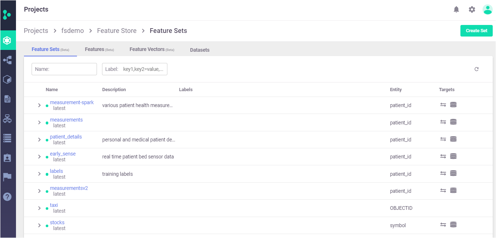

# Feature sets

In Iguazio, features are kept in a logical group called feature set. Feature set has meta data and a list of features that are associated with it. <br>
You can think about feature set in a similar way as a table in a database.
The feature set contains the following information:
- Metadata - general information which is helpful for search and organization. examples are project, name, owner, last update, description, labels and etc..
- Key attributes - entity (the join key), timestamp key
- Transformation - the transformation logic (e.g. aggregation, enrichment etc..)
- Target stores - The type and path the feature set are saved 
- Source - the source of the data (e.g. file, dataframe, databaset etc..)
- Statistics - Feature set is saved with statistics for each features such as min,max,count etc..


### Benefits:
* Ensure the same computation for both training and serving
* Enable users to search for features across projects with a business context
* Share and reuse features
* Features versioning
* Calculate features in real time - run real time feature engineering on live events


### Key attributes:
* `name` &mdash; - The feature set is a unique name within a project. 
* `entities` &mdash; - Each feature set must be associated with one or more index column. when joining feature sets the entity is used as the key column.

## Create a feature set
Creating a feature set comprises of the following steps:
- Feature set creation:  Creates a feature set object with basic definition of its name, entity and timestamp key (optional) <br>

- Add transformation:  The feature store provides the option to create a variety of transformations such as aggregations, joins, filter as well as adding custom logic. <br>
The Transformation can be done both as a batch process or in real time by processing live events. <br>
There are two engines that can be used for transformation: 
    - A graph engine called storey which is an asynchronous streaming library, for real time event <br> processing and feature extraction. Add link to the transformation section.<br>
    -Using spark <br><br>

- Data ingestion: Ingest the data to the feature sets - ingesting data could be done as batch or in real time. <br>
in this step the users defines the data source, scheduling, target data stores and the ingestion type


### Batch Ingestion

Ingest data into the feature store from various sources. the source could be a local DataFrame or files (e.g. csv, parquet) or files residing in a remote URL (e.g. S3, Azure blob). Then, run the graph transformations, infers metadata and stats and writes the results to a target data store.
When targets are not specified data is stored in the configured default targets (will usually be NoSQL for real-time and Parquet for offline).

Batch ingestion can be done locally (i.e. running as a python process in the Jupyter pod) or as an MLRun job.

#### Ingest data (locally)

Use FeatureSet to create the basic feature set definition and then the ingest method to run a simple ingestion "localy" in the jupyter notebook pod.


```python
# Simple feature set that reads a csv file as a dataframe and ingest it as is 
stocks_set = FeatureSet("stocks", entities=[Entity("ticker")])
stocks = pd.read_csv("stocks.csv")
df = ingest(stocks_set, stocks, infer_options=fs.InferOptions.default())

# specify a csv file as source and targets
source = CSVSource("mycsv", path="stocks.csv")
targets = [CSVTarget("mycsv", path="./new_stocks.csv")]
ingest(measurements, source, targets)
```

#### Ingest data using an MLRun job

Use the ingest method with run_config parameter for running the ingestion process using an MLrun job. <br>
By doing it the ingestion process is running on its own pod on the kubernetes cluster. <br>
Using this option is more robust as it can leverage the cluster resources as opposed running within the jupyter pod.<br>
It also enable users to schedule the job.


```python
# running as remote job
stocks_set = FeatureSet("stocks", entities=[Entity("ticker")])
config = RunConfig(image='mlrun/mlrun').apply(mount_v3io())
df = ingest(stocks_set, stocks, run_config=config)
```

### Real time ingestion

With real time use cases (e.g. real time fraud detection) users need to create features on live data (e.g. z-score calculation) coming from a streaming engine such as kafka. <br>
The feature store enables users to start real-time ingestion service. <br>
When running the deploy_ingestion_service the feature store creates a real time function (AKA nuclio functio). <br>
The function trigger's support the following sources: http, kafka, v3io stream <br>
The trigger as well as other parameters can be configured in the Nuclio UI. <br> 


```python
# Create a real time function that recieve http requests
# the "ingest" function runs the feature engineering logic on live events
source = HTTPSource()
func = mlrun.code_to_function("ingest", kind="serving").apply(mount_v3io())
config = RunConfig(function=func)
fs.deploy_ingestion_service(my_set, source, run_config=config)
```

### Simulation
During the development phase it's pretty common to check the feature set definition and simulate the creation of the feature set before ingesting the entire dataset which can take time. <br>
This allows to get a preview of the results.The simulation method is called infer_metadata, it infer the source data schema as well as processing the graph logic (assuming there is one) on a small subset of data. 


```python
fs.infer_metadata(
    quotes_set,
    quotes,
    entity_columns=["ticker"],
    timestamp_key="time",
    options=fs.InferOptions.default(),
)
```

### Data sources

For the batch ingestion the feature store supports dataframes or files (i.e. csv & parquet). <br>
The files can reside on S3 or Azure blob storage or on Iguazio platform. <br>
For the real time ingestion the source could be http, kafk and v3io stream etc.
When defining a source  it maps to a nuclio event triggers. <br>
Note that users can also create a custom source.

### Target stores
By default the feature sets are stored as both parquet file for training and as a key value table (in Iguazio platform) for online serving. <br>
The parquet file is ideal for fetching large set of data for training while the key value is ideal for an online application as it supports low latency data retrieval. <br>

> **Note:** When working with Iguazio platform the parquet files is stored under "Projects" container --> <project name>/fs/parquet folder. <br>
The key value table is stored under --> "Projects" container --> <project name>/fs/nosql folder. <br>
In addition to Iguazio, users can use Azure blob storage and S3 as target stores for parquet/csv files.

## Create a feature set with transformation

A feature set may contain an execution graph of operations that are performed when data is ingested, or when simulating data flow for inferring its metadata.This graph utilizes MLRun's serving graph. <br>
To learn more about setting transformation process go to [Feature set transformation](transformations.md)

## Consume features for training

### Create a feature vector

In order to retrieve the feature set one needs to create a feature vector. <br>
A feature vector is a logical definition of a list of features that are based on one or more feature sets. <br>
By default the feature vector is saved just as a logical definition, yet users can persist it by using "target=" parameter.
 


```python
features = [
    "stock-quotes.multi",
    "stock-quotes.asks_sum_5h as total_ask",
    "stock-quotes.bids_min_1h",
    "stock-quotes.bids_max_1h",
    "stocks.*",
]

vector = fs.FeatureVector("stocks-vec", features)
```

Once we have a feature vector we can run the get_offline_features method to retireve our feature set. <br>
This command fetch the data from the "offline" feature store and return a dataframe. <br>
you can also write  the result as a parquet file. <br>


```python
resp = fs.get_offline_features(vector)
resp.to_dataframe()
```

get_offline_features supports joins with another feature sets while retrieving the data. this is done by using entity_rows and entity_timestamp_column. <br>
The data is joined based on the feature set entity column/s.<br>
In the example below we join the vector with a feature set called trades. the join is based on the feature set entities and the entity timestamp.


```python
resp = fs.get_offline_features(vector, entity_rows=trades, entity_timestamp_column="time")
resp.to_dataframe()
```

## Consume features for online inference

By default feature set are ingested to both "offline" and "Online" target store. To consume the features for online applications use the get_online_feature_service method. <br>
In order to do that we need to initialize the online service and then get the relevant features. <br>
in a single get request you can get features for one or more keys. <br>
The get_online_features retrieves the data from Iguazio key value database fetching the features using the entity as a key and therefore it can returns data in few milliseconds.


```python
service = fs.get_online_feature_service("vector")
```


```python
service.get([{"ticker": "GOOG"}, {"ticker": "MSFT"}])
```


    [{'asks_sum_5h': 2162.74,
      'bids_min_1h': 720.5,
      'bids_max_1h': 720.5,
      'multi': 2161.5,
      'name': 'Alphabet Inc',
      'exchange': 'NASDAQ'},
     {'asks_sum_5h': 207.97,
      'bids_min_1h': 51.95,
      'bids_max_1h': 52.01,
      'multi': 156.03,
      'name': 'Microsoft Corporation',
      'exchange': 'NASDAQ'}]


## Show statistics and metadata

By running get_stats_table() you can view the feature set or feature vector statistics: count, mean, min, max, std, his (histogram), unique value, top, frequency


```python
stocks_set.get_stats_table()
```


```python
service.vector.get_stats_table()
```


<div>
<style scoped>
    .dataframe tbody tr th:only-of-type {
        vertical-align: middle;
    }

    .dataframe tbody tr th {
        vertical-align: top;
    }

    .dataframe thead th {
        text-align: right;
    }
</style>
<table border="1" class="dataframe">
  <thead>
    <tr style="text-align: right;">
      <th></th>
      <th>count</th>
      <th>mean</th>
      <th>min</th>
      <th>max</th>
      <th>std</th>
      <th>hist</th>
      <th>unique</th>
      <th>top</th>
      <th>freq</th>
    </tr>
  </thead>
  <tbody>
    <tr>
      <th>multi</th>
      <td>8.0</td>
      <td>925.27875</td>
      <td>155.85</td>
      <td>2161.50</td>
      <td>1024.751408</td>
      <td>[[4, 1, 0, 0, 0, 0, 0, 0, 0, 0, 0, 0, 0, 0, 0,...</td>
      <td>NaN</td>
      <td>NaN</td>
      <td>NaN</td>
    </tr>
    <tr>
      <th>total_ask</th>
      <td>8.0</td>
      <td>617.91875</td>
      <td>51.96</td>
      <td>2162.74</td>
      <td>784.877980</td>
      <td>[[4, 1, 0, 0, 0, 0, 1, 0, 0, 0, 0, 0, 0, 1, 0,...</td>
      <td>NaN</td>
      <td>NaN</td>
      <td>NaN</td>
    </tr>
    <tr>
      <th>bids_min_1h</th>
      <td>8.0</td>
      <td>308.41125</td>
      <td>51.95</td>
      <td>720.50</td>
      <td>341.596673</td>
      <td>[[4, 1, 0, 0, 0, 0, 0, 0, 0, 0, 0, 0, 0, 0, 0,...</td>
      <td>NaN</td>
      <td>NaN</td>
      <td>NaN</td>
    </tr>
    <tr>
      <th>bids_max_1h</th>
      <td>8.0</td>
      <td>308.42625</td>
      <td>51.95</td>
      <td>720.50</td>
      <td>341.583803</td>
      <td>[[4, 1, 0, 0, 0, 0, 0, 0, 0, 0, 0, 0, 0, 0, 0,...</td>
      <td>NaN</td>
      <td>NaN</td>
      <td>NaN</td>
    </tr>
    <tr>
      <th>name</th>
      <td>3.0</td>
      <td>NaN</td>
      <td>NaN</td>
      <td>NaN</td>
      <td>NaN</td>
      <td>NaN</td>
      <td>3.0</td>
      <td>Apple Inc</td>
      <td>1.0</td>
    </tr>
    <tr>
      <th>exchange</th>
      <td>3.0</td>
      <td>NaN</td>
      <td>NaN</td>
      <td>NaN</td>
      <td>NaN</td>
      <td>NaN</td>
      <td>1.0</td>
      <td>NASDAQ</td>
      <td>3.0</td>
    </tr>
  </tbody>
</table>
</div>


## Viewing and managing features in the UI


User can search features across feature sets and view their metadata and statistics using the feature store dashboard. <br>
In future versions we'll enable users to create and manage the feature set from the UI as well.




```python

```
